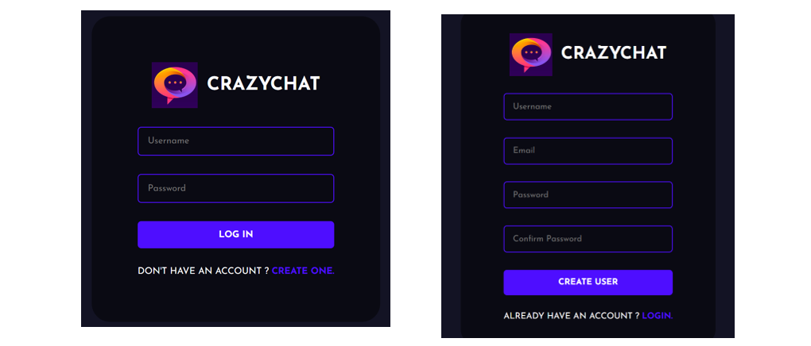
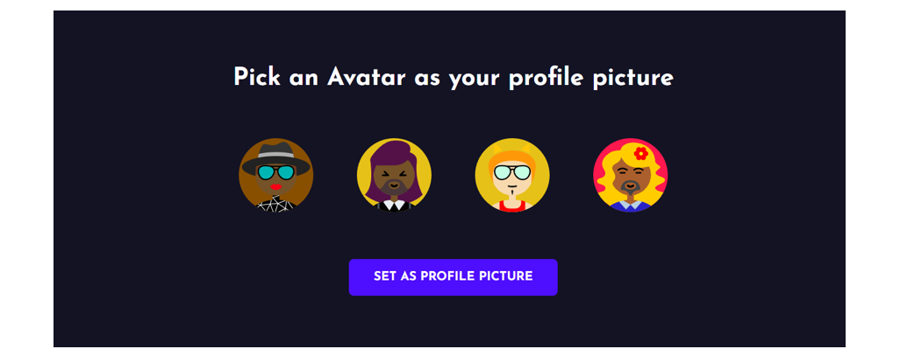
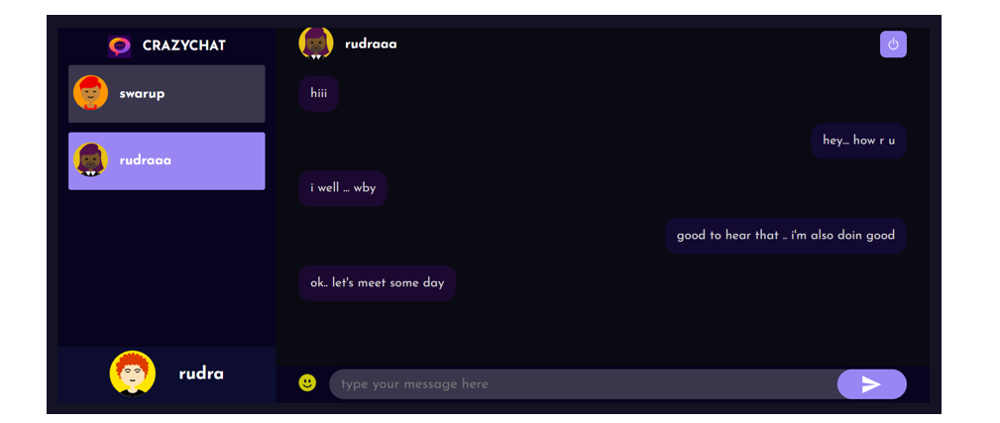

#CRAZYCHAT

CRAZYCHAT is a real-time chat application built using the MERN (MongoDB, Express.js, React.js, Node.js) stack. The application enables two users to communicate live through a localhost server, leveraging Socket.io for efficient bi-directional communication.

#Features
Real-Time Communication: Instant message delivery without page refresh.
Lightweight Implementation: Designed to operate seamlessly on a localhost server.
Modern Tech Stack: Built using the MERN stack for scalable and efficient development.

@Screenshots

#Tech Stack
CRAZYCHAT is built on modern technologies designed for high performance, scalability, and ease of development:

##Core Technologies
##Frontend: React.js
React.js powers the user interface, providing a seamless, dynamic experience for real-time communication. Its component-based architecture ensures modularity and reusability across the application.
##Backend: Node.js with Express.js
Node.js serves as the runtime environment for server-side JavaScript, while Express.js is used to handle HTTP requests and define RESTful APIs, enabling smooth communication between the frontend and backend.
##Database: MongoDB
MongoDB, a NoSQL database, efficiently stores user information and chat history. Its schema-less structure provides flexibility and scalability, ideal for modern applications.
##Real-Time Communication: Socket.io and WebSocket
Socket.io is the backbone of CRAZYCHAT's real-time functionality. It leverages the WebSocket protocol to provide low-latency, bidirectional communication. This ensures real-time message delivery, making the chat experience fast and responsive.

With WebSocket, the server doesn't need to wait for client requests to send updates. Instead, it can "push" messages as soon as new data is available. Socket.io extends WebSocket with additional features like automatic reconnection, fallback support (for browsers that don't support WebSocket), and simplified event handling.

In CRAZYCHAT, each user connection is established using Socket.io. When a user sends a message, the server receives the event, processes it, and immediately broadcasts it to the intended recipient. This design ensures that messages are delivered with minimal latency, providing a seamless chat experience.

#Requirements
##Software
Node.js (v12 or higher)
MongoDB (local setup or cloud-based, e.g., MongoDB Atlas)
Modern Web Browser (e.g., Google Chrome, Firefox)
##Hardware
4GB RAM (minimum)
500MB Disk Space

#Limitations
Limited to two users on the same device.
No message encryption or media sharing.
Restricted to localhost; not accessible over the internet.
